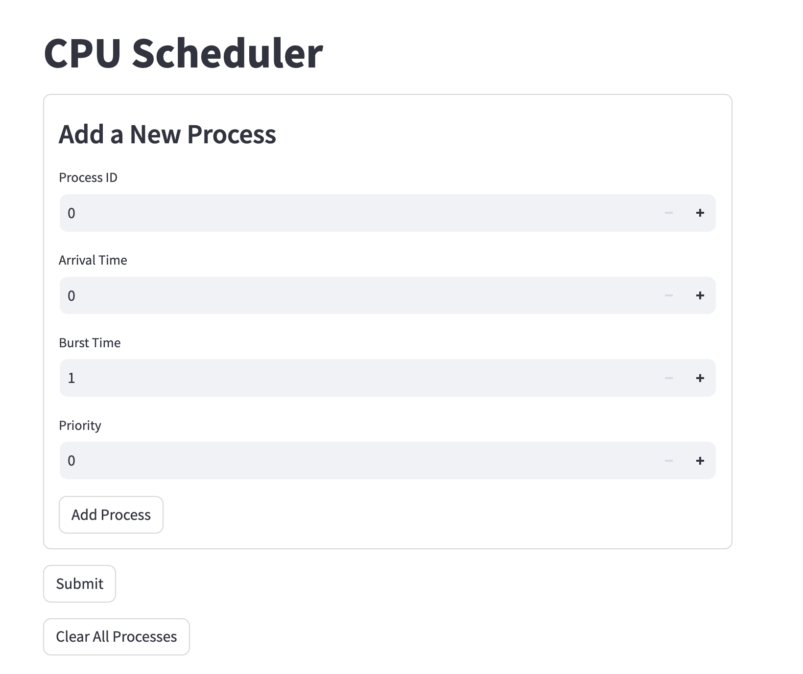
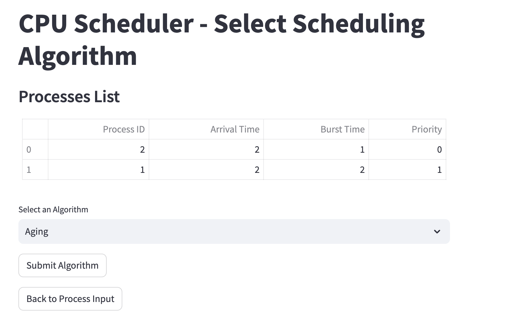
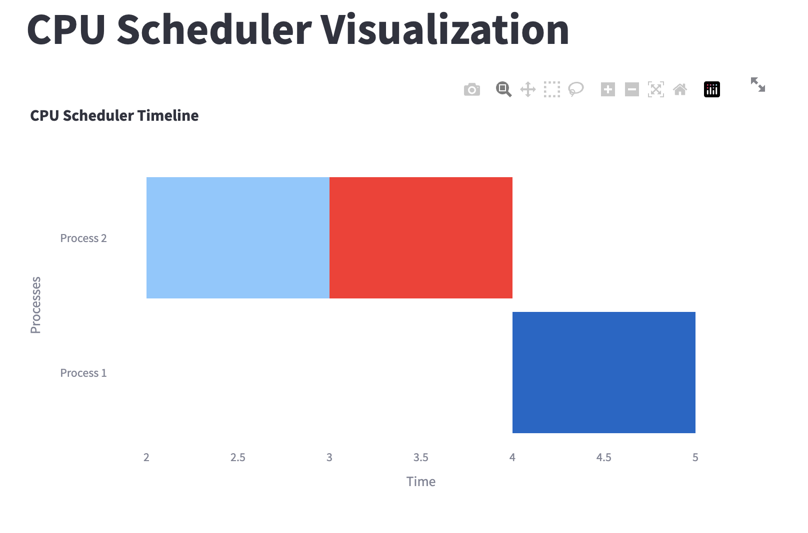
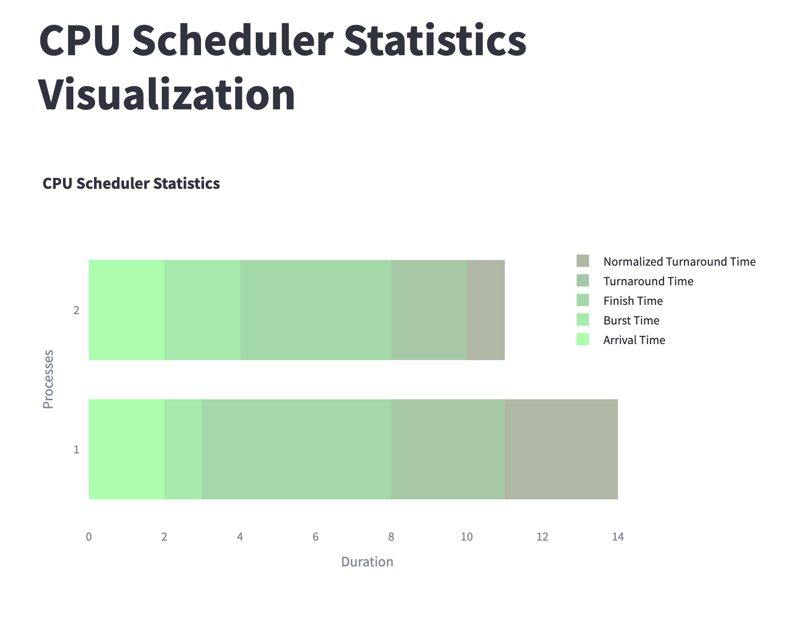

# CPU Scheduler Project

## Overview

This project implements various CPU scheduling algorithms in C++ and provides an interactive frontend for users to input process details, select algorithms, and view scheduling outputs.

## Features

- **Interactive Frontend:** Allows users to add processes with details such as process ID, arrival time, burst time, and priority.
- **Algorithm Selection:** Users can choose from a variety of CPU scheduling algorithms to observe their effects on the processes.
- **Visual Outputs:** Displays timelines and statistics using Plotly in Streamlit, providing intuitive visualizations of scheduling results.

## Frontend Screenshots









## Implemented Algorithms

1. **First-Come First-Served (FCFS)**
   - **Description:** Executes processes in the order they arrive, without preempting any process.
   - **Use Case:** Simplest scheduling algorithm suitable for batch systems with non-preemptive processes.

2. **Round Robin (RR)**
   - **Description:** Allocates a fixed time slice (quantum) to each process in a circular manner.
   - **Use Case:** Suitable for time-sharing systems where fairness and responsiveness are important.

3. **Shortest Job First (SJF)**
   - **Description:** Schedules the shortest job (process with the smallest burst time) next.
   - **Use Case:** Minimizes average waiting time and is effective for non-preemptive scheduling in batch systems.

4. **Shortest Remaining Time (SRT)**
   - **Description:** Preemptively schedules the process with the shortest remaining burst time.
   - **Use Case:** Provides optimal scheduling for preemptive environments where new processes with shorter bursts can arrive.

5. **Priority Scheduling**
   - **Description:** Assigns priority levels to processes and executes higher priority processes first.
   - **Use Case:** Ensures important tasks are executed promptly; used in real-time systems and interactive applications.

6. **Highest Response Ratio Next (HRRN)**
   - **Description:** Uses the ratio of waiting time to burst time to prioritize processes.
   - **Use Case:** Improves response time compared to SJF by considering the age of processes.

7. **Feedback (Multilevel Feedback Queue)**
   - **Description:** Implements multiple queues with different priorities and allows processes to move between queues based on their behavior.
   - **Use Case:** Supports time-sharing systems where processes require different levels of CPU time.

8. **Aging**
   - **Description:** Prevents starvation by gradually increasing the priority of processes that wait in the system for a long time.
   - **Use Case:** Enhances fairness in priority scheduling by ensuring lower priority processes eventually get executed.

9. **Longest Job First (LJF)**
   - **Description:** Schedules the process with the longest burst time next.
   - **Use Case:** Used in systems where long-running processes need to be prioritized or guaranteed execution time.

10. **Longest Remaining Time (LRT)**
    - **Description:** Preemptively schedules the process with the longest remaining burst time.
    - **Use Case:** Similar to LJF but allows new processes with longer bursts to preempt currently running processes.

## Usage

To run the project:

1. Compile the C++ files (`scheduler.cpp`, `fcfs.cpp`, etc.) using a C++ compiler.
2. Start the Streamlit application for the frontend:
   ```sh
   streamlit run frontend.py
